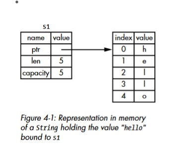
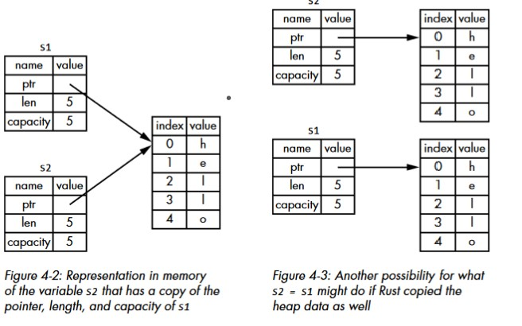

# [Ownership in Rust](https://youtu.be/VFIOSWy93H0)

- This is Rust's most unique feature ,and it enables Rust to make memory safety guarantees without needing a garbage collector.
- All programs have to manage the way they use a computer’s memory while running. Some languages have [_garbage collection_](https://www.geeksforgeeks.org/garbage-collection-java/) that constantly looks for no longer used memory as the program runs; in other languages the programmer must explicitly allocate and free the memory. Rust uses a third approach: memory is managed through a system of ownership with a set of rules that the compiler checks at compile time. None of the ownership features slow down your program while it’s running.

## [Stack & Heap](https://youtu.be/_8-ht2AKyH4)

- Both the stack and the heap are parts of memory that are available to your code to use at runtime, but they are structured in different ways. The stack stores values in the order it gets them and removes the values in the opposite order.This is referred to as _last in, first out_. Think of a stack of plates: when you add more plates, you put them on top of the pile, and when you need a plate, you take one off the top. Adding or removing plates from the middle or bottom wouldn’t work as well! Adding data is called _pushing_ onto the stack, and removing data is called _popping_ off the stack.
- All data stored on the stack must have a known, fixed size. Data with an unknown size at compile time or a size that might change must be stored on the heap instead. The heap is less organized: when you put data on the heap, you request a certain amount of space. The operating system finds an empty spot in the heap that is big enough, marks it as being in use, and returns a pointer, which is the address of that location. This process is called _allocating on the heap_ and is sometimes abbreviated as just _allocating_. Pushing values onto the stack is not considered allocating. Because the pointer is a known, fixed size, you can store the pointer on the stack, but when you want the actual data, you must follow the pointer.

  - Think of being seated at a restaurant. When you enter, you state the number of people in your group, and the staff finds an empty table that fits everyone and leads you there. If someone in your group comes late, they can ask where you’ve been seated to find you.

- Pushing to the stack is faster than allocating on the heap because the operating system never has to search for a place to store new data; that location is always at the top of the stack. Comparatively, allocating space on the heap requires more work, because the operating system must first find a big enough space to hold the data and then perform bookkeeping to prepare for the next allocation.
- Accessing data in the heap is slower than accessing data on the stack because you have to follow a pointer to get there. Contemporary processors are faster if they jump around less in memory. Continuing the analogy, consider a server at a restaurant taking orders from many tables. It’s most efficient to get all the orders at one table before moving on to the next table.
  - Taking an order from table A, then an order from table B, then one from A again, and then one from B again would be a much slower process. By the same token, a processor can do its job better if it works on data that’s close to other data (as it is on the stack) rather than farther away (as it can be on the heap). Allocating a large amount of space on the heap can also take time.
- When your code calls a function, the values passed into the function (including, potentially, pointers to data on the heap) and the function’s local variables get pushed onto the stack. When the function is over, those values get popped off the stack.
- Keeping track of what parts of code are using what data on the heap, minimizing the amount of duplicate data on the heap, and cleaning up unused data on the heap so you don’t run out of space are all problems that ownership addresses. Once you understand ownership, you won’t need to think about the stack and the heap very often, but knowing that managing heap data is why ownership exists can help explain why it works the way it does.

|                             | Pros                                                                                                                       | Cons                                                                                                                  |
| --------------------------- | -------------------------------------------------------------------------------------------------------------------------- | --------------------------------------------------------------------------------------------------------------------- |
| **Garbage Collection**      | &#183; Error Free\* <br> &#183; Faster write time                                                                          | &#183; No Control over memory <br> &#183; Slower and unpredictable runtime performance <br>&#183; larger Progeam size |
| **Manual Memory Mangement** | &#183; Control over memory <br> &#183; Faster runtime performance <br>&#183; Smaller Program size                          | &#183; Error Prone <br> &#183; Slower write time                                                                      |
| **Ownership**               | &#183; Control over memory <br> &#183; Error Free\* <br> &#183; Faster runtime performance <br>&#183; Smaller Program size | &#183; Slower Write Time.Learning Curve (_Fighting with Borrower checker_)                                            |

- So if your writing a hidh level app(website) it makes sense to sacrifice runtime performance for a lesser size for ease of use and faser write time you get with the _garbage collector_ and manual memory management for high-level components.

## Ownership Rules

1. Each value in Rust has a variable that’s called its _owner_.
2. There can be only one owner at a time.
3. When the owner goes out of scope, the value will be dropped.

## Variable scope

- A _scope_ is the range within a program for which an item is valid.
- A varible is valid from the point its declared to the end of that scope.

  ```rs
  { // s is not valid here; it's not yet declared
  let s = "hello"; // s is valid from this point forward
  // do stuff with s
  } // this scope is now over, and s is no longer valid

  ```

## The String Type

- To illustrate ownership, we need a datatype that is more complex.The types covered previously are all stored on the stack and popped off the stack when their scope is over, but we want to look at data that is stored on the heap and explore how Rust knows when to clean up that data.
- We’ll use String as the example here and concentrate on the parts of String that relate to ownership. These aspects also apply to other complex data types provided by the standard library and that you create.
- String literals are convinient but not suitable for every situation. One reason is that they’re immutable. Another is that not every string value can be known when we write our code: e.g., taking user input and storing it? For these situations, Rust has a second string type, String. This type is allocated on the heap and as such is able to store an amount of text that is unknown to us at compile time.
  `let s = String::from("Hello")`
- The double colon `::` is an operator that allows us to namespace this particular from function under the String type rather than using some sort of name like `string_from`. _More about this in “Method Syntax”_

- This kind of string can be mutated:

  ```rs
  let mut s = String::from("hello");
  s.push_str(", world!"); // push_str() appends a literal to a String
  println!("{}", s); // this will print `hello, world!`
  ```

- **So, what’s the difference here? Why can String be mutated but literals cannot? The difference is how these two types deal with memory**

## Memory and Allocation

- In the case of a string literal, we know the contents at compile time, so the text is hardcoded directly into the final executable. _This is why string literals are fast and efficient_. But these properties only come from the string literal’s immutability. Unfortunately, we can’t put a blob of memory into the binary for each piece of text whose size is unknown at compile time and whose size might change while running the program.
- With the String type, in order to support a mutable, growable piece of text, we need to allocate an amount of memory on the heap, unknown at compile time, to hold the contents. This means

  - The memory must be requested from the operating system at runtime.
  - We need a way of returning this memory to the operating system when we’re done with our `String`.

- First part is done by us when we call `String::from` (_Common for all languages_).However, the second part is different. In languages with a garbage collector (GC), the GC keeps track and cleans up memory that isn’t being used anymore, and we don’t need to think about it. Problem with this is we need to pair exactly one allocate with exactly one free otherwise we get bugs.
- Rust takes a different path: the memory is automatically returned once the variable that owns it goes out of scope and rust calls its `drop` function.

## Ways that Variables and Data Interact:Move

- Multiple variables interact with the same data in different ways.

  ```rs
  let y= 5;
  let x= y;
  ```

- We can probably guess what this is doing: “bind the value 5 to x; then make a copy of the value in x and bind it to y.” We now have two variables, x and y, and both equal 5. This is indeed what is happening, because integers are simple values with a known, fixed size and these two 5 values are pushed onto the stack.
- Lets Consider the String Version;

  ```rs
  let S1 = String::from("string");
  let s2 = s1;
  ```

  - A String is made up of three parts, shown on the left: a pointer to the memory that holds the contents of the string, a length, and a capacity.This group of data is stored on the stack. On the right is the memory on the heap that holds the contents.
  <center>
  
  </center>

  - **_Length_** - Memory in bytes that the contents of the String are currently using.
  - **_Capacity_** - Memory in bytes that String has received from Operating System.
  - When we assign s1 to s2, the String data is copied, meaning we copy the pointer, the length, and the capacity that are on the stack. We do not copy the data on the heap that the pointer refers to. In other words, the data representation in memory looks like _Figure 4-2_
  <center>
  
  </center>
  - The representation does not look like _Figure 4-3_, which is what memory would look like if Rust instead copied the heap data as well. If Rust did this, the operation `s2 = s1` could be very expensive in terms of runtime performance if the data on the heap were large.
  - Earlier, we said that when a variable goes out of scope, Rust automatically calls the drop function and cleans up the heap memory for that variable.But `Figure 4-2` shows both data pointers pointing to the same location. This is a problem: when s2 and s1 go out of scope, they will both try to free the same memory. This is known as a _double free error_ and is one of the memory safety bugs we mentioned previously. Freeing memory twice can lead to memory corruption, which can potentially lead to security vulnerabilities.

- To ensure memory safety, Rust considers s1 to no longer be valid and, therefore, Rust doesn’t need to free anything when s1 goes out of scope. Check out what happens when you try
  to use s1 after s2 is created; it won’t work.
